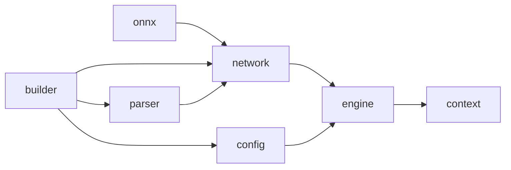
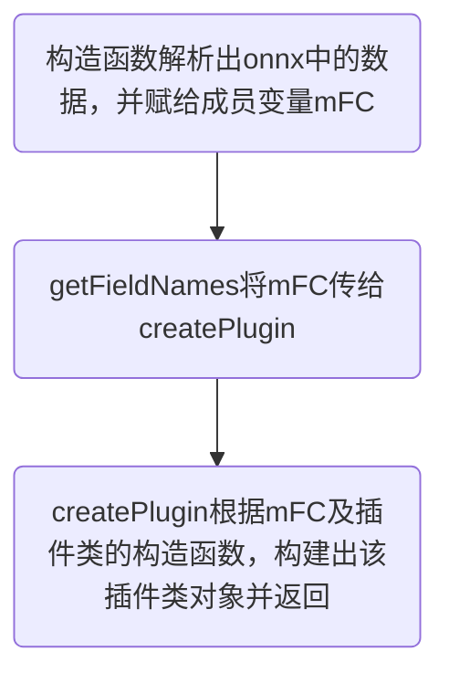

(字节二面问到，啥也不会，血泪教训)

## TensorRT使用流程

**步骤**

1. 定义网络
2. Build（对网络进行优化）
3. Inference

TRT Build生成的模型文件（plan file）不是跨平台的。不同平台需要生成不同的模型文件，不过如果架构相同是可能可以运行的，比如P40生成的，可以在P4上跑，但会报warning

**主要的API**

1. 模型构建（builder）
2. 模型转换（比如onnx parse）
3. 模型定义（network）
4. 模型执行（engine）

**C++API部署模型的流程及相关API的简介**

1. 定义一个IBuilder* builder，一个由builder创建的network，一个由builder创建的用于配置优化策略的config，一个用来解析onnx文件的parser。
2. parser会将onnx文件中的模型参数和网络结构解析出来存到network。根据network和config创建engine。
3. builder设置最大的batch size，实际推理时输入的batch和其相同效率最高，如果不足最大的batchsize，效率就会变慢。
4. config设置最大的工作空间workspace size，确保每层有足够的空间进行优化运算。
5. 根据engine创建context，用于推理。




### 流程

1. 根据模型结构使用TRT API复现定义的网络
2. 使用builder生成一个优化后的engine（设定配置文件，根据配置项来优化网络）
3. 将engine序列化到文件中，也就是生成plan file
4. 读取序列化的plan file，反序列化，并做inference


### build阶段

在Build阶段，TRT会根据GPU的特性和输入数据的大小(batchsize)，选择最后的实现算法(比如矩阵计算方法)，所以最好build和inference都在一块显卡上。

**max batch size设置**：决定了优化的结果，因为上面具体的优化是和batch size有关的。

**max workspace size设置**：尽量大，确保每层有足够的空间做运算。
在builder阶段，TRT自动选择最优的算法来实现网络，具体的方法是：把所有算法跑一遍，看看哪个最快就用哪个。
有些算法运行时，中间是有临时变量的，比如卷积的计算——将图像转换成矩阵（矩阵就占用了空间），然后进行矩阵的运算完成卷积操作。所以**需要保证workspace size足够大才能正常完成这些优化算法**。

### 序列化

```python
IHostMemory *serializedModel = engine->serialize();
```

序列化顾名思义就是将engine写到文件中。

TRT build阶段比较耗时，所以一般操作为离线build并序列化。然后线上反序列化模型文件（engine）并inference。

### inference阶段

- **反序列化**

```python
IRuntime* runtime = createInferRuntime(gLogger);
ICudaEngine* engine = runtime->deserializeCudaEngine(modelData, modelSize, nullptr);
```

- **调用context进行inference操作**

```python
IExecutionContext *context = engine->createExecutionContext();
```

1. engine内存储网络结构、模型参数以及必要的存储空间。
2. context则存储网络的中间结果：网络每一层的中间结果。

**因此多个context可以共享一个engine，即共享权值。**比如可以实现并行处理图片（一个cuda stream(流)使用一个engine和context？？？）

- **推理**

```python
context->enqueue(batchsize, buffers, stream, nullptr); # 显式批处理
context->enqueueV2(buffers, stream, nullptr); # 隐式批处理

# void* buffers[2];
# buffers[inputIndex] = inputBuffer;
# buffers[outputIndex] = outputBuffer;
```

`batchsize`：当前有多少图像

`buffers`：输入数据和输出结果的指针组合

### 内存管理（不重要）

TRT显存管理：在生成context时，会根据max batch先开辟足够的显存。如果不想在生成context的时候开辟显存，就使用`createExecutionWithoutDeviceMemory`这个接口生成context。

## TensorRT实现plugins自定义

### 步骤总览

1. 编写`plugin和plugin creator`
   必须保证pluginType和pluginName、pluginVersion和pluginVersion一致（用于反序列化时，可以找到对应的creator）
2. 注册`plugin creator`
   使用宏定义`REGISTER_TENSORRT_PLUGIN`或者函数`getPluginRegistry()->registerCreator(*mCreator, libNamespace);`注册`plugin creator`。二者是一样的，宏定义的实现就是这个函数。
3. 序列化
   将`plugin`的参数和权值写到文件里
4. 反序列化
   1. 根据文件中读取到的pluginType和pluginVersion从plugin库中**唯一的**获得对应的creator
   2. 使用creator根据参数生成plugin
   3. 使用将该plugin添加到network中，这样就可以反序列化成功，且进行inference


### API编写

#### 插件类编写

一般使用`IPluginV2DynamicExt`，其支持动态尺寸

##### 构造函数和析构函数

一般写三个，分别用于parse阶段、clone阶段、反序列化阶段

```cpp
/** 03
* @brief Einsum 用在parse阶段，用于创建该插件(op)时调用的构造函数，需要传递权值及参数
*/
Einsum(std::string equation);
/** 04
* @brief Einsum 用于clone阶段，复制这个plugin时用到该构造函数
*/
Einsum(std::string equation, int N, int K, int C, int T, int V, int W);
/**
* @brief Einsum 用于反序列化(deserialize)阶段，将序列化好的权重和参数传入该plugin并创建该op
* @param serialData 序列化的数据，从中读取该层数据即可
* @param serialLength
*/
Einsum(void const* serialData, size_t serialLength);
```

```cpp
~Einsum() override; //! 调用terminate释放显存，完成析构
/**
* @brief terminate 释放该op开辟的一些显存空间——用于析构函数，在engine被摧毁时调用
*/
void terminate() throw() override;
```

##### getNbOutputs××

```cpp
/**
* @brief getNbOutputs 该op返回多少个Tensor(即几个output），一般直接返回1(一个输出)
* @return
*/
int getNbOutputs() const throw() override;
```

##### initialize××

```cpp
/**
* @brief initialize 初始化函数，在engine创建时调用(即op准备开始run之前执行)
*      主要初始化一些提前开辟空间的参数，一般都是cuda操作需要的参数（比如conv需要提前开辟weight和bias的显存），
* 算子需要这些参数，就必须提前在这里开辟显存。
*      注意：如果该op算子需要开辟比较大的显存空间，尽量不要自己去申请显存空间，可以使用TensorRT官方接口传过来的workspace指针来获取显存空间。
* 因为如果该op被一个网络调用很多次，而这个op需要开辟很多显存空间，那么TensorRT在构建network时就会根据这个插件被调用的次数开辟很多显存，导致显存溢出。(--self：而使用workspace指针，就保证每个op都使用的同一块地址，不会导致显存溢出。所有op都在同一块空间运算，运算完一个op，将下一个op的参数放入该空间，执行下一个op，各个op的数据无需保留，所以运行下一个op直接清除上一个op的数据即可)
* @return
*/
int initialize() throw() override;
```

##### getOutputDataType

```cpp
/**
* @brief getOutputDataType 返回输出的数据类型（包括float, half[float16], int 8, int32, bool)
*      一般直接返回输入数据的数据类型，即输入输出数据类型一致
* @param index
* @param inputTypes
* @param nbInputs
* @return
*/
DataType getOutputDataType(int index, const nvinfer1::DataType* inputTypes, int nbInputs) const throw() override;
```

##### getOutputDimensions

```cpp
//!
//! \brief getOutputDimensions 获得batch的维度
//!     TensorRT在支持Dynamic-shape时，batch这一维度必须是explicit，也就是说，TensorRT处理的维度从以往的三维[3,-1,-1]变成了[1,3,-1,-1]。
//! 该函数就是返回batch的维度，上面的例子就是返回1。
//!     我们在这个成员函数中要做的就是根据输入维度推理出该op的输出维度（一般直接将输入维度作为输出的维度即可）
//!     注意：虽然输出维度是由输入维度决定的，但这个输出维度其实是内定的（也就是在计算之前已经算出来了）。
//! 如果该op的输出维度需要根据实际运行计算得到，是不可以的。（--self：比如需要使用if语句，当实际运算的结果不同，返回的输出也不同时，这种情况就无法实现，
//! 也就是说并非完全意义上的动态尺度，这个尺度需要根据输入可以计算出才可以使用）
//!
// DynamicExt plugins returns DimsExprs class instead of Dims
DimsExprs getOutputDimensions(
int outputIndex, const nvinfer1::DimsExprs* inputs, int nbInputs, nvinfer1::IExprBuilder& exprBuilder) throw() override;
```

##### getWorkspaceSize××

```cpp
/**
     * @brief getWorkspaceSize 返回该op需要的(临时显存大小)中间显存变量的实际数据大小(byte size)——一般都是使用该官方函数获取，比较规范
     *      在这里确定这个op需要多大的显存空间去运行，这样在实际运行时就可以直接使用TensorRT开辟好的空间而不是自己去申请显存空间，避免上述显存溢出的问题。
     */
size_t getWorkspaceSize(const nvinfer1::PluginTensorDesc* inputs, int nbInputs,
                        const nvinfer1::PluginTensorDesc* outputs, int nbOutputs) const throw() override;
```

##### enqueue

```cpp
/**
* @brief enqueue op实际执行时运行的函数
*      将自己实现的计算过程放在该函数内，一般为cuda实现操作（C++实现的op操作也可以放进来，不过因为时cpu执行，速度比较慢）
*      根据输入inputs计算输出outputs，传给相应的指针即可。
*      注意：如果op需要在显存中暂存一些中间变量，可以通过传进来的指针参数workspace获取
*      默认写的.cu是FP32精度，当TensorRT在FP16运行模式下，运行到不支持FP16的插件op时，会自动切换到FP32模式，等op运行完再切换回FP16，
* 因此，这样频繁的数据转换也会造成时间的消耗增加
* @param workspace 分配的工作空间的地址，通过该地址，来暂存op计算需要的中间变量，避免重复单独开辟空间
* @param stream
* @return
*/
int enqueue(const nvinfer1::PluginTensorDesc* inputDesc, const nvinfer1::PluginTensorDesc* outputDesc,
const void* const* inputs, void* const* outputs,
void* workspace,
cudaStream_t stream) throw() override;
```

##### configurePlugin

自己编写的Plugin中只**进行了中间变量的计算**

```cpp
//!
//! \brief configurePlugin 判断输入和输出的数据类型是否正确。也可以通过这个配置信息告诉TensorRT去选择合适的算法来调优这个模型——貌似也负责计算相关的中间变量
//!     我们一般写的plugin执行代码都是固定的，不要调优，所以这个主要是针对官方的op
//!
void configurePlugin(const nvinfer1::DynamicPluginTensorDesc* in, int nbInputs,
                     const nvinfer1::DynamicPluginTensorDesc* out, int nbOutputs) throw() override;
```

##### getSerializationSize

```cpp
//!
//! \brief getSerializationSize 返回序列化(serialize)该op时需要写多少字节到buffer中
//!     一般为权重+参数的总的字节数
//! \return
//!
size_t getSerializationSize() const throw() override;
```

##### serialize

```cpp
//!
//! \brief serialize 根据序列化大小getSerializationSize()，把需要用到的数据按照顺序序列化到buffer中
//!     就是指权重+参数+额外的内存空间(应该是中间变量吧)序列化到buffer中
//! \param buffer
//!
void serialize(void* buffer) const throw() override;
```

##### supportsFormatCombination

```cpp
// DynamicExt plugin supportsFormat update.
//!
//! \brief supportsFormatCombination TensorRT调用该方法来判断pos索引对应的(输入/输出)是否支持inOut[pos].format和inOut[pos].type指定的格式和数据类型
//!     知乎有说，但是没读懂
//!     根据个人实际编写情况来看，该函数非常重要，必须确保输入的format是否符合要求，不要想当然的认为必然符合，因为测试发现，可能会传入不符合的数据，也就是传入了无法预料的数据
//!     数据类型指DataType：float, half[float16], int8, int32, bool
//!     格式指TensorFormat：kLINEAR，kNCHW，kNCHW2，等（暂时不懂具体啥区别）
//! \param pos
//! \param inOut
//! \param nbInputs
//! \param nbOutputs
//! \return
//!
bool supportsFormatCombination(int pos, const nvinfer1::PluginTensorDesc* inOut, int nbInputs, int nbOutputs) throw() override;
```

#### 插件工厂类编写

这里最重要的就是`PluginFieldCollection`这个数据结构（其作为这里的成员变量mFC），他记录了该层的各个变量（就是onnx中的ATTRIBUTES：如权值，偏置等参数）及其值。根据这些值就可以调用插件类，构建出该层。
即该数据结构的主要作用就是为了**在解析时将onnx模型的op权值和参数解析出来，然后创建plugin，即只在parser时使用**。



##### 构造函数

```cpp
// EinsumCreator methods
//! 对应createPlugin中的操作
//! 初始化plugin field meta data（插件领域的元数据？）
//!     暂且理解为该插件所用到的数据，以关键字+数据的形式存储（即PluginField)
//! PluginField: 以变量名+值的形式存储，该plugin的数据
EinsumCreator::EinsumCreator()
{
    std::cout << "初始化 plugin Creator 类\t IN PluginCreator" << std::endl;
    //! 个人理解---
    //! 使用"equation"的原因是，ONNX模型中Einsum对应的ATTRIBUTES就是equation，可以通过netron查看该结点的信息得到该结论
    //! ONNX该plugin有几个ATTRIBUTES，就在这里添加几个，名字一定要一样，而且数据类型要对应
    mPluginAttributes.emplace_back(PluginField("equation", nullptr, PluginFieldType::kCHAR, 1));
    mFC.nbFields = mPluginAttributes.size();
    mFC.fields = mPluginAttributes.data();
}
```

##### getFieldNames

```cpp
//!
//! \brief getFieldNames
//!     返回PluginFieldCollection结构数据，包含添加插件的参数名和类型
//! \param PluginFieldCollection mFC: 这是成员变量
//!     主要作用是传递这个op所需要的权重和参数，在engine推理时不会使用，而在parse中使用（比如caffe2trt,onnx2trt），决定了是否可以解析成功。
//! 当使用parse解析这个op时，这个op的权重和参数会经历Models-->TensorRT engine --> TensorRT runtime的过程。
//!     具体过程参考知乎链接
//! \return
//!
const PluginFieldCollection* getFieldNames() throw() override;
```

##### createPlugin

```cpp
//!
//! \brief createPlugin 通过得到的PluginFieldCollection去创建一个plugin，将op需要的权重和参数取出来，然后调用插件类的第一个构造函数，来创建plugin
//!
//! 另一种理解（参考https://github.com/LitLeo/TensorRT_Tutorial/blob/master/blogs/TensorRT%20Plugin%E4%BD%BF%E7%94%A8%E6%96%B9%E5%BC%8F%E7%AE%80%E4%BB%8B-%E4%BB%A5leaky%20relu%E5%B1%82%E4%B8%BA%E4%BE%8B.md）
//!     根据序列化数据，反序列化为plugin类。
//! 需要的参数有：
//!     plugin的名字，该参数非常重要，是反序列化为哪种plugin的唯一凭证
//!     序列化数据
//!     序列化后的数据的长度
//! \param name 该plugin的名字
//! \param fc   序列化所需的数据
//! \return
//! 02
IPluginV2DynamicExt* createPlugin(const char* name, const nvinfer1::PluginFieldCollection* fc) throw() override;
```

##### deserializePlugin

```cpp
//!
//! \brief deserializePlugin 将op读取到的onnx模型的data数据反序列化到network中。调用插件类的第三个构造函数，来创建plugin
//!
IPluginV2DynamicExt* deserializePlugin(const char* name, const void* serialData, size_t serialLength) throw() override;
```

#### 参考链接

https://github.com/xn1997/TensorRT-EinsumPlugin——我自己的仓库，里面的`Einsum.cpp/h`注释的很清楚，直接对照看即可

## 参考链接

[实现TensorRT自定义插件(plugin)自由](https://zhuanlan.zhihu.com/p/297002406)——讲的很细，建议看这个

[TensorRT Plugin使用方式简介-以leaky relu层为例](https://github.com/LitLeo/TensorRT_Tutorial/blob/master/blogs/TensorRT%20Plugin%E4%BD%BF%E7%94%A8%E6%96%B9%E5%BC%8F%E7%AE%80%E4%BB%8B-%E4%BB%A5leaky%20relu%E5%B1%82%E4%B8%BA%E4%BE%8B.md)——github一个简单介绍，有时间看看


# Tips

## CHW和HWC的区别

- CHW: 对于GPU更优。使用CUDA做infer或者后处理的话，由于硬件DRAM的原因，CHW可以保证线程是以coalescing的方式读取。具体性能对比参考[Programming_Massively_Parallel_Processors](https://github.com/Syencil/Programming_Massively_Parallel_Processors)
- HWC: 对于CPU更优。使用CPU进行处理的时候，HWC格式可以保证单个线程处理的数据具有连续的内存地址。而CPU缓存具有[空间局部性](https://zh.wikipedia.org/wiki/CPU缓存)，这样能极大的提升效率。
- 综上：如果后处理使用CPU进行decode，建议在onnx输出HWC格式，如果使用GPU进行decode，建议在onnx输出CHW格式。对于输入端则没有具体测试，主要是相信tensorflow虽然按照之前的HWC格式，但是在操作中肯定也是做了优化

### 参考链接

https://github.com/Syencil/tensorRT