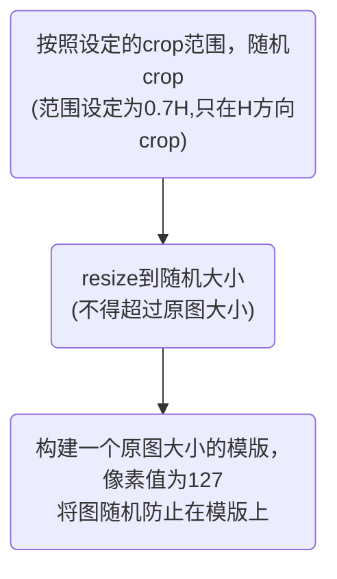

# 行人重识别

脑图链接：https://naotu.baidu.com/file/baccb9ce2306f5924945fcdfd368a92e


<big>**<font color=red>网络结构参考《107_ReID相关知识点（PCB、BoT、MGN）.md》</font>**</big>

利用2019年开源的行人重识别大赛的一个程序作为基础进行修改，结构就是简单的一个ResNet50，只不过把conv5的下采样换成了1，而不是2，为了获得更多的空间信息。

BN：将triplet loss和ID loss**（softmax loss）**解耦，方便训练。ID loss适合将数据归一化后使用，而triplet loss适合在自由的欧式空间使用，如果都在归一化的超球面下使用，那么triplet loss就比较难把正负样本的距离拉开。


## 数据平衡

<big>**原因：**</big>
①数据严重不平衡。
②主要目的是为了学习到不同图像的特征，而不是图片的ID，需要进行连续化减少ID类别数，防止使用softmax时出现维度爆炸。

1. 去掉**长尾数据**

   将只有单张图片的ID去除，不参与训练

2. **标签连续化**

   重新定义ID，使其连续化，去掉长尾数据后，部分ID会发生丢失，ID不连续

   如果不连续化ID，在构建网络时，分类的输出层会大，多了许多无意义的参数

3. **重采样**

   低于100，高于1的pid，以0.5的概率，图片数量直接翻倍。15W-->21W

4. 采样方案

   16个行人，每个行人4张图片

5. **label smooth**

   将标签范围规定到一0～1之间，防止过拟合。

   参考链接：[label smoothing(标签平滑)学习笔记](https://zhuanlan.zhihu.com/p/116466239)

   相比one-hot，不易造成过拟合。N为总的类别数。

   

## 数据扩增方法

1. 水平翻转 

2. 颜色抖动

3. 仿射变换

4. ==RandomPatch==

   1. 优于随机擦除
      1. 原因：相比用固定值填补空缺，利用复杂的背景更能增加模型的泛化能力

   ```mermaid
   graph TD
   first100(前100张训练集)
   AddPatchPool1("加入patch池")
   AddPatchPool2("加入patch池")
   crop("分别随机crop一张图作为patch池<br />(根据设定的patch面积和常宽比计算出crop的w和h)")
   later100("100张以后的所有训练集")
   paste("从patch池中随机选择一个patch<br />在输入图片上随机一个位置<br />将patch 粘贴到该位置")
   加入patch池-->crop
   first100-->AddPatchPool1
   later100-->AddPatchPool2-->paste
   
   ```

5. ==RSA(RandomShiftAugment)==

6. 优点：模拟遮挡，失真，目标检测不精确带来的大部分背景干扰。

   crop->resize->随机贴在模板上



## 无监督训练（利用无标签数据）

选择一组较好的模型，对无标签数据进行特征提取，然后使用聚类算法为其添加伪标签，并加入训练集。

**聚类方法：**

- [ ] 聚类

  > 1. 统计所有无标签数据特征
  > 2. 根据特征聚1000个类
  > 3. 每个类簇赋予一个标签

  缺点：类别设置不灵活，设置的过少，簇内引入噪声图片；过多，一类图片被分为两类

- [x] ==循环搜索==

  > 1. 计算各个data间的距离（建议使用程序中的余弦距离或者时rerank后的距离）$\Longrightarrow$得到距离矩阵dist（query，gallery）——这里query和gallery一致，即data既是gallery也是query，对角线的距离应该时0
  > 2. 统计dist所有距离小于0.5（自己设计）的索引index（query值，gallery值）——如果考虑所有的图片，那么就不要这一步
  > 3. 为每个gallery赋予一个距离其最近的query作为其ID$\Longrightarrow$最后的类别数量大概率会少于gallery类
  > 4. 去除互为ID的ID

  优点：自动设置类别，类别数量更加合理

## 模型修改

**基础baseline：**

只使用全局特征（GAP）

**MGN**：

多出来两个分支，硬分割为2个和3个条带，引入了局部特征

**RMGL：**

- RP结构：在中间层分成多个条带，分别提取特征，在输出层再拼接回原来的大小。属于普遍意义上的分割，不像MGN只能在输出层分割。

  意义：使得每个条带尽可能不包含其他条带的信息。如：在输入层分割，完全不包含其他条带信息；在输出层，可能一个条带就包含了整副图的信息。

  ​		该方法属于权衡版，介于输入于输出层之间。

- ABP池化层：统计最后卷积层，所有channel最大响应的高度直方图，按照直方图确定每个条带的高度范围。

  确保每个条带的最大值分布一致

**ours：**

- 结果测试RP结构效果并不好，不如MGN，说明在本数据中RP结构不好用
- 结构使用是MGN，添加了一个分支，直接把特征图硬分割为（2×2），将左右的偏移信息也引入，较MGN有所提升

## 模型集成

只修改backbone：resnet，resnextresnet-ibn-a, resnet-ibn-b, se-resnet-ibn-a

将所有的距离矩阵相加，然后使用余弦距离+rerank排序

### ResNet

参考`各种深度学习网络结构及笔记2019.md`

### ResNeXt

参考链接：[ResNeXt详解](https://zhuanlan.zhihu.com/p/51075096)

前为resnet，后为resnext

多路径带来的效果更好，实验得出的？


### HRnet

4个stage，每个阶段都融合多尺度信息

## 总loss

ID loss和Triplet loss的**比例是0.1和0.9**

**ID loss应该尽量小，triplet特征尽量大，才能使得feat区分性更明显**
ID loss只是为了加速收敛，而triplet才是起主要作用的。

```python
总loss=0.1 ID loss + 0.9 Triplet loss
```

### triplet loss


**训练方法：**用的是下面的Batch Hard
**（距离其实就是用的余弦距离，选好pair之后再计算loss）**


较大的margin能够增强模型对不同类样本的区分度，但是如果在训练初期就将<u>margin设置得比较大，则可能会增加模型训练的难度</u>，进而出现网络不收敛的情况。在模型训练初期先使用一个较小的值对网络进行初始化训练，之后再根据测试的结果对margin的值进行适当的增大或缩小，这样可以在保证网络收敛的同时让模型也能拥有一个较好的性能。

> 一个batch为16*4=64
>
>  程序中的apn选取方法为：
>
> 1. 前向计算出每张图的feature
> 2. 计算所有图之间的距离$(64,64)$
> 3. 为每个样本选出对应的ap、an——距离最远的同ID图片，距离最近的不同ID图片
> 4. 根据挑选出的apn计算loss
>
> 注意3中挑选pn时使用的余弦距离，在4中直接使用了，并没有重新计算。

### CE loss

其实是softmax loss（并不是sigmoid+BCE loss）

这里**使用了label smooth**

## 距离计算

**第一步：余弦距离**

也就是1-特征向量之间的余弦夹角，所以值越大越不相似。
$$
dis = 1 - \frac{a * b}{|a|*|b|}
$$
**第二步：rerank（Jaccard杰卡德距离）**

参考链接：[谁能解释下 行人重识别reranking的原理？](https://www.zhihu.com/question/271308170/answer/361943914)

> rerank步骤
>
> 1. 已知目标(quary)与搜索出来的前20个匹配结果（gi）的距离Di
> 2. 再计算quary与gi的杰卡德距离Dj
> 3. 加权Di，Dj作为quary和gi的最终距离，并根据这个距离对gi重新排序

> 杰卡德距离计算方法：
>
> 不会：大致思路就是根据待检测图片得到了多个候选图，如果再根据候选图去进行检索，其中包含了最开始的待检测图片，那么该候选图和间检索图片之间的距离就应该越小

根据原图利用余弦距离找出距离其最近的20个图，再找出这20个图最近的6个图，判断这6个图中原图所在的位置，共同得到该图的索引模型。

余弦距离+Jaccard距离

# 评价指标

$0.5*rank1+0.5*mAP$，具体含义参考：<u>《117_mAP实现原理（目标检测、ReID）.md》</u>

