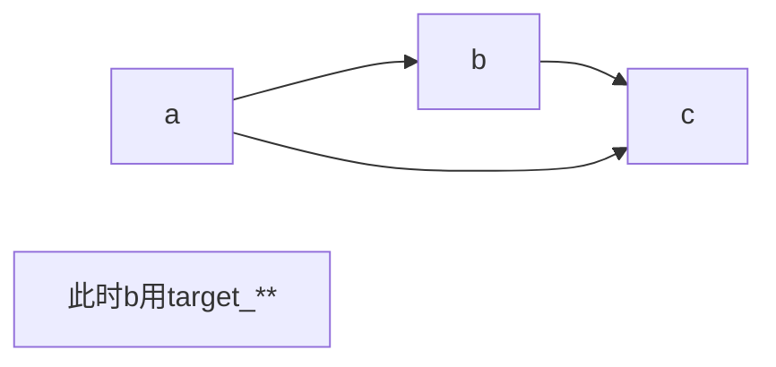

# 语法指令

CMake官方文档链接：[链接地址](https://cmake.org/cmake/help/v3.16/manual/cmake-commands.7.html)

## 设定工程编译方式（debug、release...）

1. `-Wall`选项的意义。参考链接：[区别gcc中的-w -W和-Wall选项](https://blog.csdn.net/cjtstrive/article/details/85375477)

   编译会显示所有的警告

   `-w`：不显示任何警告

   `-W`：显示部分编译器认为会出现错误的警告

2. `CMake`编译`Debug`和`Release`模式设置。参考链接：[区别gcc中的-w -W和-Wall选项](https://blog.csdn.net/cjtstrive/article/details/85375477)

   `Debug`模式:

   ```cmake
   set(CMAKE_BUILD_TYPE Debug )
   set(CMAKE_CXX_FLAGS_DEBUG "$ENV{CXXFLAGS} -O0 -Wall -g -ggdb")
   ```

   `Release`模式:

   ```cmake
   set(CMAKE_BUILD_TYPE Release )
   set(CMAKE_CXX_FLAGS_RELEASE "$ENV{CXXFLAGS} -O3 -Wall")
   ```

   `-O`：模型优化等级。0不优化，3优化最高等级

   <font color='red'>**注意**</font>:

   后面的可选配置对于任何一种模式都可以适用，因此，可以通过修改配置实现

   1. 优化后的`Debug`

      ```cmake
      set(CMAKE_CXX_FLAGS_DEBUG "$ENV{CXXFLAGS} -O3 -Wall -g -ggdb")
      ```

   2. 带有调试信息的`Release`

      ```cmake
      set(CMAKE_CXX_FLAGS_RELEASE "$ENV{CXXFLAGS} -O3 -Wall -g -ggdb")
      ```

   - 当`Debug`正常，`Release`出现段错误

     一般是优化级别导致的内存错误，可以使用上面的`1.`***修改Debug优化级别***与Release一致，还原错误环境，并在线调试。

   - 当`Release`正常，`Debug`错误

     那么一定有错误，只是`Release`没有发现，需要在`Debug`模式下排除bug。

## project

语法为

```cmake
project(projectname [CXX] [C] [Java])
```

作用：

1. 定义工程名字

2. 指定该工程支持的语言，默认支持所有语言，指定方法

   ```cmake
   project(projectname LANGUAGES CXX CUDA)
   ```

   上述语句代表，该工程只支持C++和CUDA语言。

## target_compile_features

语法为

```cmake
target_compile_features(<target> <PRIVATE|PUBLIC|INTERFACE> <feature> [...])
```

为**库**指定编译特性。<font color=red>？？？编译特性有哪些？？？</font>

举例

```cmake
target_compile_features(particles PUBLIC cxx_std_11)
```

制定`particles`库使用`C++11`特性编译，这样**所有**使用`particles`库的其他可执行文件**都会使用**`C++11`编译

---

# CMakeLists.txt编写

## Qt Creator 构建项目树（cpp和h文件分开，方便阅读）

目录结构

```
./
├── CMakeLists.txt
└── main_src
    ├── CMakeLists.txt
    ├── main.cpp
    └── matplotlibcpp.h
```

在`./CMakeLists.txt`中添加

```cmake
add_subdirectory(main_src)
```

在`./main_src/CMakeLists.txt`中添加

```cmake
set(minimal_SRCS
    main.cpp
    )
set(minimal_MOCS
    matplotlibcpp.h
    )
    
find_package(Qt5Core) # ***重要***
QT5_WRAP_CPP(MOCS ${minimal_MOCS}) # ***重要***

add_executable(${PROJECT_NAME}
    ${minimal_SRCS}
    ${MOCS} # 不加貌似也可以——不懂原理***重要***
    )
```

这样cpp和h文件会在项目栏的**两个文件夹**下，如果***不加***标记的重要部分上两行，则cpp和h会在**同一个文件夹**下显示。

<big>不加最后一行重要，同样会在两个文件夹显示</big>：不必链接头文件，直接包含即可

---

- 小细节

  1. 调用python的numpy库

     1）使用系统自带的python

     2）numpy安装方法为

     ```shell
     sudo apt-get install python-numpy
     ```

     这样才能在`find_package(PythonLibs REQUIRED)`时，把numpy的路径也添加进来

# B站视频学习

参考链接：

[CMake 入门实战](https://www.hahack.com/codes/cmake/)

[cmake使用示例与整理总结(一些预定义的变量)](https://blog.csdn.net/QTVLC/article/details/82380413)

[CMake命令/函数汇总（官方手册翻译版）](https://www.cnblogs.com/52php/p/5684588.html)

## 语法

1. **`PROJECT_BINARY_DIR`和`PROJECT_SOURCE_DIR`**

   `PROJECT_SOURCE_DIR`：源码的根目录。始终为最外侧`CMakeLists.txt`所在的文件夹。

   `PROJECT_BINARY_DIR`：执行`cmake`时所在的目录。如在`build`文件夹内执行`cmake ..`，那么其指代的路径就是`./build`。

2. ```cmake
   aux_source_directory(./ DIR_LIB_SRCS)
   ```

   将目录`./`下的所有<font color=red>`cpp`文件(源文件)</font>，全部加到变量`DIR_LIB_SRCS`中；添加源文件时直接使用`${DIR_LIB_SRCS}`即可。

   免去了逐个添加文件的繁琐操作。

3. ```cmake
   add_library(MyLib [STATIC|SHARED] ${DIR_LIB_SRCS})
   ```

   将所有的源文件`DIR_LIB_SRCS`生成库，库名为`MyLib`。

   `[STATIC|SHARED]`：设置生成的是静态库`.a`还是动态库`.so`，不填默认静态库。

4. ```cmake
   SET(LIBRARY_OUTPUT_PATH ${PROJECT_BINARY_DIR}/lib)
   ```

   指定库文件`.a .so`生成的目录。

   `LIBRARY_OUTPUT_PATH`：库文件生成后所在的目录。

   使得生成的库文件所在位置清晰好找。**注意以后使用该变量时，一律使用${LIBRARY_OUTPUT_PATH}来调取**

5. ```cmake
   SET(EXECUTABLE_OUTPUT_PATH ${PROJECT_BINARY_DIR}/bin)
   ```

   指定可执行文件生成的目录。

   `EXECUTABLE_OUTPUT_PATH`：可执行文件生成后所在的目录。

6. ```cmake
   add_executable(demo ${DIR_SRCS})
   ```

   将所有源文件`DIR_SRCS`生成可执行文件，文件名为`demo`。

7. ```cmake
   target_link_libraries(demo MyLib)
   ```

   将`demo`及其依赖的库函数(cpp函数)`MyLib`链接起来，即可以调用到对应的函数。放在`add_executable()`后面。

8. `link_libraries`

   ```cmake
   link_libraries(MyLib)
   ```

   同`target_link_libraries(demo MyLib)`，但必须放在`add_executable()`前面。

9. `link_directories`

   ```cmake
   link_directories(demo so/a库文件的父目录)
   ```

   与`link_libraries`的唯一区别就是，这里只需要指定库文件父目录即可，而后者需要指定到具体的so文件

10. `target_include_directories`

   ```cmake
   target_include_directories(demo MyLib)
   ```

   将MyLib文件夹下的头文件，链接到demo，使其找到对应的头文件，效果类似于`include_directories`

11. `include_directories`

    ```cmake
    include_directories(${PROJECT_SOURCE_DIR}/mylib)
    ```

    将该位置源文件`.cpp`依赖库函数(`.cpp`)的头文件`.h`路径包含进来，确保源文件可以找到`.h`声明，进而从库文件`.a .so`中找到对应的方法。

    这里的路径是`PROJECT_SOURCE_DIR`，和库文件生成路径不一样：因为h不需要编译，直接引用即可。

12. `add_subdirectory`

    ```cmake
    add_subdirectory(top top)
    ```

    **添加子目录**。将子文件夹生成的库导入，使别的程序可以调用该子目录下的库。参考链接：[CMake:add_subdirectory(...)隐含的用法](https://www.cnblogs.com/Need4Speak/p/5418818.html)。

    放在根目录下的`CMakeLists.txt`内。
12. ```cmake
    CONFIGURE_FILE(
        "${PROJECT_BINARY_DIR}/config/config.h.in"
        "${PROJECT_BINARY_DIR}/config/config.h"
        )
        
        OPTION(USE_MYFLAG ON)  # 设置变量的名字
        
        IF(USE_MYFLAG)  # 根据变量值选择执行的编译选项(IF固定写法)
        INCLUDE_DIRECTORIES(${PROJECT_SOURCE_DIR}/mylib)或者其他操作
        ENDIF(USE_MYFLAG)
    ```

    将`.h.in`中的内容编译生成`.h`，用于函数调用。`h`可以换成`hpp`。

    功能：**自定义编译选项**。如，有多个功能相同的函数，编译时选择使用哪个函数。

    `.h.in`文件内容：

    ```cmake
    #cmakedefine USE_MYFLAG
    ```

    编译时，便会出现`USE_MYFLAG`变量，可选择`ON或OFF`，分别对应1和0。如上面的`OPTION`设置。

    **CPP文件中相应的写法**

    ```cmake
    #include "../config/config.h" //这里是.hpp不是.h，因为上面CONFIGURE_FILE生成的是.hpp文件
    #ifdef USE_MYFLAG
    	#include "../mylib/mymath.h"
    #else
    	#include <math.h>
    #endif
    ```

    `#ifdef    #else    #endif`可以用在程序的任何位置，方便编译调试（如`debug和release`下不同的输出操作）

12. **DEBUG调试配置**

    ```cmake
    add_definitions(-std=c++11)  # 添加c++版本，一般11比较稳定
    # 这三行固定写法，不必修改
    SET(CMAKE_BUILD_TYPE "Debug")
    SET(CMAKE_CXX_FLAGS_DEBUG "$ENV{CXXFLAGS} -O0 -Wall -g -ggdb")
    SET(CMAKE_CXX_FLAGS_RELEASE "$ENV{CXXFLAGS} -O3 -Wall")
    ```

    固定写法，不必修改

13. ```cmake
    MESSAGE()
    ```

    打印信息。

14. ```cmake
    file(GLOB variable mylib/*.cpp)
    file(GLOB_RECURSE  variable mylib/*.cpp)
    ```

    将路径内所有`.cpp`文件地址全部赋予`variable`。一般使用`GLOB_RECURSE`。

    区别：`GLOB`只搜索`mylib`文件夹内的`cpp`，而`GLOB_RECURSE`搜索`mylib`及其子目录下的`cpp`。

15. ```cmake
    cmake_host_system_information(RESULT hostname QUERY HOSTNAME)
    ```

    将系统名字赋予给`hostname`变量。使用`${hostname}`读取。

16. ```cmake
    if(${hostname} STREQUAL "nvidia")  # 判定当前设备名是不是nvidia
    
    else if()
    
    else()
    
    endif()
    ```

    判断语句。

    不等于使用：

    ```cmake
    if(NOT ${hostname} STREQUAL "nvidia")
    ```

17. ```cmake
    find_package(CUDA REQUIRED)
    include_directories(${CUDA_INCLUDE_DIRS})
    link_directories(${CUDA_LIBRARIES})
    ```

    一般找到库名后，头文件和lib文件就是`库名_INCLUDE_DIRS和库名_LIBRARIES`。

    查找顺序：
    	默认先按Module模式查找，查找失败自动以Config模式查找；也可以指定`CONFIG`关键字，强制使用Config模式。
    
    1. Module模式下查找`FindXXX.cmake`文件
       如果指定位置就先在指定位置查找，否则就从cmake安装时的`Modules`查找（比如`/usr/local/share/cmake/Modules`）
    2. Config模式查找`XXXConfig.cmake`或`XXX-config.cmake`文件
       首先定义一个带有`_ROOT`的变量，再定义一个带有`_DIR`的变量，然后使用`find_package()`就可以在该目录下查找`.cmake`文件；如果这两个变量所指的路径都可以找到包，那么就只使用`_DIR`下的，`_ROOT`不起作用。
    
    参考链接：
    [find_package()找包流程的介绍](https://www.cnblogs.com/penuel/p/13983503.html)
    
    [FindXXX.cmake模块编写的教程](https://zhuanlan.zhihu.com/p/97369704?utm_source=wechat_session)
    
18. ```cmake
    LINK_LIBRARIES()
    # 和
    target_link_libraries()
    ```

# 原理部分

## Debug和Release的区别

## `target_link_libraries`中`PRIVATE、PUBLIC、INTERFACE`含义

参考链接：[cmake：target_** 中的 PUBLIC，PRIVATE，INTERFACE](https://blog.csdn.net/qq_35866736/article/details/107780833)（非常详细，清晰，重点看这个）

[CMake编译中target_link_libraries中属性PRIVATE、PUBLIC、INTERFACE含义](https://blog.csdn.net/turbock/article/details/90034787)（只说来什么时候用，较为简单可以不看）

**测试工程目录结构：**

```bash
cmake-test/                 工程主目录，main.c 调用 libhello-world.so
├── CMakeLists.txt
├── hello-world             生成 libhello-world.so，调用 libhello.so 和 libworld.so
│   ├── CMakeLists.txt
│   ├── hello               生成 libhello.so 
│   │   ├── CMakeLists.txt
│   │   ├── hello.c
│   │   └── hello.h         libhello.so 对外的头文件
│   ├── hello_world.c
│   ├── hello_world.h       libhello-world.so 对外的头文件
│   └── world               生成 libworld.so
│       ├── CMakeLists.txt
│       ├── world.c
│       └── world.h         libworld.so 对外的头文件
└── main.c
```

**调用关系：**

```bash
                                 ├────libhello.so
可执行文件────libhello-world.so
                                 ├────libworld.so
```

这三个关键字指定的是目标文件依赖项的使用**范围（scope）**或者一种**传递（propagate）**。[官方说明](https://link.zhihu.com/?target=https%3A//cmake.org/cmake/help/v3.15/manual/cmake-buildsystem.7.html%23transitive-usage-requirements)

可执行文件(main)依赖 libhello-world.so， libhello-world.so 依赖 libhello.so 和 libworld.so。

1. main.c 不使用 libhello.so 的任何功能，因此 libhello-world.so 不需要将其依赖—— libhello.so 传递给 main.c，hello-world/CMakeLists.txt 中使用 PRIVATE 关键字；
   实际表现：**hello-world.cpp中使用了hello.h而hello-world.h中没有使用hello.h**，这也就意味着main.cpp在包含hello-world.h时，是不会包含hello.h，即main.cpp不会使用libhello.so的任何功能，这样就可以保证hello的依赖库不会影响main.cpp，实现库的隔离。

   ```mermaid
   graph TD
   hello.h-->hello-world.cpp
   hello-world.h-->main.c
   main.c根本就不会使用hello中的任何内容
   ```

   ```cmake
   target_link_libraries(hello-world PRIVATE hello) // hello-world 表示可执行文件目标
   target_include_directories(hello-world PRIVATE hello)
   ```

2. main.c 使用 libhello.so 的功能，但是libhello-world.so 不使用，hello-world/CMakeLists.txt 中使用 INTERFACE 关键字；
   实际表现：**hello-world.cpp中没有使用hello.h而hello-world.h中使用了hello.h**，这也就意味着main.cpp在包含hello-world.h时，会包含hello.h，即main.cpp会使用libhello.so的功能，这样hello-world.so就相当于起到了为main.c提供hello.so接口的功能。

   ```mermaid
   graph TD
   hello.h-->hello-world.h
   hello-world.h-->main.c
   main.c会使用hello的功能
   ```

   

3. main.c 和 libhello-world.so 都使用 libhello.so 的功能，hello-world/CMakeLists.txt 中使用 PUBLIC 关键字；
   实际表现：**hello-world.cpp中使用hello.h且hello-world.h中使用了hello.h**，这也就意味着hello-world.cpp使用libhello.so的功能，而且main.cpp在包含hello-world.h时，会包含hello.h，即main.cpp会使用libhello.so的功能。

   ```mermaid
   graph TD
   hello.h-->hello-world.h
   hello.h-->hello-world.cpp
   hello-world.h-->main.c
   main.c和hello-world.cpp都会使用hello的功能
   ```

**注意：一般通常情况下，源文件都会包含自己的头文件，也就是说上述情况下，如果hello-world.h包含了hello.h那么hello-world.cpp包含hello-world.h时也包含了hello.h，可以一般只会有PRIVATE和PUBLIC两种情况**

==target_include_directories的关键字与target_link_libraries一致==

### 扩展：在cpp中和h中添加头文件有什么区别

在源文件(cpp)中添加头文件（如head），那么意味着该库**对外不可见**head库，也就是调用该库的程序不会发现有head库的存在。

在头文件(h)中添加头文件(head)，那么意味着该库会**对外可见**head库，即调用该库的程序会发现head库的存在

### `target_**`和`link_libraries`使用场景



`target_link_libraries`：
库b依赖库a，而库c链接到b，但c也依赖a，那么这种情况下就可以在b中target链接a，且**必须要用PUBLIC属性**，这样c链接b时自动链接a
==总的来说：就是向上传递库时，使用==

`link_libraries`:
以上场景也可以在c处用`link_libraries`链接a，向下传递库，这样b也会自动链接a

## 将静态库链接到动态库

**问题：**
`add_library()`默认生成静态链接库
现有静态库`gcnLib.a`，要将其连接到动态库`actionClassifyLib`，如果直接使用

```cmake
target_link_libraries(actionClassifyLib PRIVATE gcnLib)
```

会发生错误：`error adding symbols: Bad value`

**原因：**
静态库想链接进动态库，必须满足一定的条件，即静态库需要加-fPIC选项编译，编译成Position Independent Code(也就是可重定位的代码)，否则就会报错：error adding symbols: Bad value。

**解决方法：**
将编译方式选项添加-fPIC即可，即如下语句

```cmake
set(CMAKE_CXX_FLAGS "${CMAKE_CXX_FLAGS} -fpic")
```

### 扩展

在工程搭建时，可能会有**将静态库链接成动态库的需求**，如出于代码保护的角度，某些模块会发布.a扩展名的静态库，我们要将多个这样的静态库链接成一个动态库。但与直接link目标文件不同的是，**ld以默认参数执行时，会把静态库中没有用到的函数过滤掉，导致生成的so并未包含所要的函数**，因此要**加上--whole-archive参数，以保证所有的函数都包含在生成的so中**。代码如下：

```cmake
add_library(
    ${MODULE_NAME}
    SHARED
    ${CMAKE_SOURCE_DIR}/builttime.c #要生成一个so，至少要包含一个源文件，实在没有可以把库的编译时间戳打到这儿。
)

target_link_libraries(
    ${MODULE_NAME}
    ${${MODULE_NAME}_EXTRA_LDFLAGS}
    "-Wl,--whole-archive" #告诉编译器，从这里开始，所有的库的内容都包含到so中
    ${LOCAL_MODULES} #可以是以源代码生成的静态库
    ${PREBUILT_MODULES} #可以是预先生成的静态库
    "-Wl,--no-whole-archive" #告诉编译器，从这里开始，以后的库的内容不用都包含到so中
)
```


## add_subdirectory() 使用解析

功能：将source_dir目录下的库，文件等进行cmake编译，使其链接到项目中。

**官方说明如下：**

```cmake
add_subdirectory(source_dir [binary_dir] [EXCLUDE_FROM_ALL])
```

**使用方法：**

1. 如果source_dir是当前目录（CMakeLists.txt所在目录）的子目录，不需要添加binary_dir，直接使用`add_subdirectory(source_dir)`即可
2. 如果source_dir不是当前目录的子目录，而是其他自定义的目录，就必须添加binary_dir，用于存储source_dir的相关文件，即`add_subdirectory(source_dir binary_dir)`

**binary_dir的具体作用**

`add_subdirectory(source_dir binary_dir)`会将source_dir目录生成的库文件存放在binary_dir这个名字的目录下。
所以binary_dir的名字可以任意设置。

举例如下：

目录数为：

> hello-world/
> ├── CMakeLists.txt
> ├── main.c
> ├── test
> │   ├── CMakeLists.txt
> │   └── main.c
> ├── hello
> │   ├── CMakeLists.txt
> │   ├── hello.c
> │   └── hello.h
> └── world
>     ├── CMakeLists.txt
>     ├── world.c
>     └── world.h

要生成 test 目录下的可执行程序，操作步骤为： 1.mkdir build 2. cd build 3.cmake .. 4. make，此时，**这个名为 hello_binary_dir 的目录就在 test/build/ 目录下，里面存放 libhello.so。**

### 参考链接

[cmake：add_subdirectory() 注意事项](https://zhuanlan.zhihu.com/p/85980099)