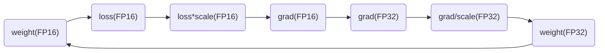

## 知识蒸馏

1. 一个**训练好的**大型的老师网络，一个**未训练**的小的学生网络（可以是直接从大网络中裁掉一部分得到的小网络）
2. 两个网络各选取几个关键的层（比如各5个，这些层两两之间是对应的），然后使用一种方法来衡量对应两层输出的相似度以计算损失，比如就将两个特征图的所有像素的均方差和作为该层的loss，这个loss就反映了学生网络的输出与老师网络输出的相似性，相似度越高说明小网络越能学到老师网络的精粹。同时也在输出层使用普通的loss。
3. 具体过程就是同时对大小网络输入同一张图片，然后计算两个网络中间层输出的相似度损失，及小网络的输出损失，然后进行反向传播微调小网络。

**核心思想：**

利用训练好的大网络辅助训练小网络，这样小网络就可以朝着更加像大网络的方向学习，这样更有可能得到性能与大网络差不多的小网络。

知识蒸馏其实是**用高信息密度（墒）的输出去训练小网络**。因为大网络的输出每个$y_i$都不是0，也就说**对于一个输入X，其输出Y不仅编码了这个X的信息，也编码其它的class的信息，信息密度更大**。而大网络训练的输出label是**onehot，信息密度很小，仅仅编码了该X**，这样的onehot去训练小网络**优化效率很低是因为信息密度太小**。

### soft target（开篇之作）

**hard target 包含的信息量（信息熵）很低，soft target包含的信息量大，拥有不同类之间关系的信息**（比如同时分类驴和马的时候，尽管某张图片是马，但是soft target就不会像hard target 那样只有马的index处的值为1，其余为0，而是在驴的部分也会有概率。）

这样的好处是，这个图像可能更像驴，而不会去像汽车或者狗之类的，而这样的soft信息存在于概率中，以及label之间的高低相似性都存在于soft target中。但是如果soft targe是像这样的信息[0.98 0.01 0.01]，就意义不大了，所以需要在softmax中增加温度参数T（这个设置在最终训练完之后的推理中是不需要的）


按照softmax的分布来看，随着T参数的增大，这个软目标的分布更加均匀。


Loss是两者的结合，Hinton认为，最好的训练目标函数就是这样，并且第一个目标函数的权重要大一些。


**蒸馏过程**：

1. 训练大模型：先用hard target，也就是正常的label训练大模型。
2. 计算soft target：利用训练好的大模型来计算soft target（使用一个较大的T得到soft target）。也就是大模型“软化后”再经过softmax的output。
3. 利用soft target来训练小模型（此时小模型的T和2中的T一样），同时在小模型的基础上再加一个额外的soft target的loss function，通过lambda来调节两个loss functions的比重。
4. 预测时将小模型中的T改为1即可。

### 与label smooth的区别

label smooth同样是将one-hot硬编码，变成软编码，与这里teacher网络训练得到的软编码的区别是：
前者的软编码过于简单，即所有的非1元素都变为一样的较小的值，这其实就**相当于一个性能较差的老师网络**。
后者由于是网络学习到的软编码，包含的信息更多，编码效果更好。

### 参考链接

[蒸馏神经网络到底在蒸馏什么？（设计思想篇）](https://zhuanlan.zhihu.com/p/39945855)

## 剪枝

[论文总结 - 模型剪枝 Model Pruning](https://xmfbit.github.io/2018/10/03/paper-summary-model-pruning/)——对很多论文做了总结，可以参考，同时附上了程序源码
作者试图通过实验证明，很多剪枝方法并没有他们声称的那么有效，很多时候，无需剪枝之后的权重，而是直接随机初始化并训练，就能达到这些论文中的剪枝方法的效果。当然，这些论文并不是一无是处。作者提出，是剪枝之后的结构更重要。这些剪枝方法可以看做是网络结构的搜索。

### 简单的方法

#### 根据参数绝对值裁剪

用参数的绝对值来评估重要性，将参数较小的参数去掉。

训练出来的权重如果不稀疏不利于pruning怎么办，常用的办法是在训练时loss中加regularizer，尤其是L1 regularizer，从而使得权重稀疏化。

#### 基于通道的裁剪

将BN的$\gamma$作为参考，越小说明该channel重要性越低，直接将该channel裁掉。同样为了得到一个$\gamma$稀疏的网络，也可以使用L1正则化，只不过这里的正则化参数是各层的$\gamma$。

**具体裁剪实现方法：**
由于通道和参数绝对值的裁剪方法，无法单独去掉裁剪参数，因此，具体的实现方法，就是对裁剪的参数使用0替代，也就是做一个0-1mask与原参数相乘，并把对应位置置0，从而实现参数裁剪。（但该方法其实并没有真正减少参数量，只是变成了0而已）

#### 基于层的剪枝

可以同基于通道的裁剪，同样利用BN来评估一个层（比如Conv+BN+Relu）的重要性，将不重要的层直接砍掉，这里的重要性是**以整个层的$\gamma$均值为参考**。

**具体裁剪实现方法：**

基于层的剪枝，是可以直接去掉该层的，因此，属于真正意义上的剪枝，参数变少了，注意在对具有shortcut的结构进行剪枝时，需要在裁剪CBL后，调整相应的结构，以使网络结构正常，如去除shortcut等。

### 微调精度恢复训练

即使是微调训练精度恢复不上去，依然可以采用知识蒸馏技术，将剪枝前的模型作为教师模型，引导剪枝后的学生模型进行蒸馏训练。需要强调的是，**蒸馏在这里只是辅助微调**，如果注重精度优先，剪枝时尽量剪不掉点的比例，这时蒸馏的作用也不大；**如果注重速度，剪枝比例较大，导致模型精度下降较多，可以结合蒸馏提升精度**。或者如果微调后精度能很好的恢复上去，也不要采用蒸馏策略，因为蒸馏策略会限制学生网络的精度上限，且蒸馏训练会需要更大的GPU内存来实现，增加了实验的成本。

### 参考链接

[深度卷积网络的剪枝和加速（含完整代码）](https://zhuanlan.zhihu.com/p/347188485)

## 量化

### FP16

参考链接：[入门mmdetection（捌）---聊一聊FP16](https://zhuanlan.zhihu.com/p/114438961)

#### 原理

将模型放在FP16精度下运行，大幅减少内存占用量，可以提高batch和输入特征图大小。

推理在FP16下进行，权值更新在FP32下进行，确保低精度下仍然可以准确更新权值。

#### 流程

==model负责计算FP16精度下的loss，放大后的梯度grad==

==optimizer负责计算FP32精度下的更新后的参数==

==将FP32的最终更新参数，拷贝到FP16的model中，完成最终的权值更新==

1. 拷贝模型(model)的权值参数到优化器(optimizer)；然后将model参数精度变为FP16。

   此时二者参数一致，只是model中的是FP16。本来optimizer中的权值是和model同一位置，通过该拷贝操作，实现model和optimizer中权值的解耦，方便后面使用optimizer在FP32精度上更新参数（原权值+梯度）使用。

2. 在model下计算loss（此时权值、特征图、loss都是FP16）；将loss乘以放大尺度（scale），然后进行反向传播求得梯度（此时梯度也是FP16）。

   如果不放大loss，那么梯度可能会非常的小，超出FP16的表达范围，放大后，所有求得的梯度也会随之放大，那么就可以用FP16表示了。

3. 拷贝梯度（FP16）到optimizer中（此时optimizer中的梯度变成了FP32）；将梯度（FP32）除以scale，还原原本的梯度；在optimizer中更新权值：原权值+梯度。

   梯度拷贝到优化器后，optimizer中的grad和权值都是FP32，那么就可以按照FP32的精度进行权值更新。

4. 拷贝optimizer中更新后的权值（FP32）到model中（FP16），完成FP16的推理，FP32下的权值更新。



#### FP16训练时梯度溢出的现象

错误提醒为

> Gradient overflow. Skipping step, loss scaler 0 reducing loss scale to 131072.0

意思是：梯度上溢出，丢弃掉本次的训练结果，然后将损失尺度减少（一半以2倍减少）


<big><font color='red'>原因分析：</font></big>
设置的太大，导致计算出的梯度产生了上溢出（超出了FP16所能表达的最大范围？），因此必须调小scale，这样就不会产生上溢出。
amp默认使用动态损失放大，**为了充分利用FP16的范围，缓解舍入误差，所以尽量使用最高的放大倍数**，而且在训练过程中如果scale被调小，那么在训练一段时间后还会重新自动增大scale。

<big><font color='red'>为什么提高scale可以缓解摄入误差？</font></big>
根据FP16的实现原理，可以看出，反向传播是在FP16下进行的，因此如果scale过小，那么求出的梯度就很小，那么再转换为FP32就会产生很大的误差，所以应该调大。

混合精度训练（Mixed Precision）
混合精度训练的精髓在于“在内存中用FP16做储存和乘法从而加速计算，用FP32做累加避免舍入误差”。混合精度训练的策略有效地缓解了舍入误差的问题。

缓解梯度溢出的方法
将模式设置为O1。
使用BN。

##### 参考链接

[Apex使用教程 与 梯度爆炸问题： Gradient overflow. Skipping step, loss scaler 0 reducing loss scale to 131072.0](https://blog.csdn.net/zjc910997316/article/details/103559837)

### INT8

目前最简单的实现方案是英伟达的tensorRT方案，**直接量化，无需retrain**，实现简单；

#### 原理

我们的目的是把原来的float 32bit 的卷积操作（乘加指令）转换为int8的卷积操作，这样计算就变为原来的1/4，但是访存并没有变少哈，因为我们是在kernel里面才把float32变为int8进行计算的。

最粗糙、最本质的原理就是这个图：


​      很简单是吧！就是把你一个layer的激活值范围的给圈出来，然后按照绝对值最大值作为阀值（*因此当正负分布不均匀的时候，是有一部分是空缺的，也就是一部分值域被浪费了；这里有个小坑就是，假如我的激活址全是正的，没有负值，那么你怎么映射呢？*），然后把这个范围直接按比例给映射到正负128的范围内来，公式如下：

```cpp
FP32 Tensor (T) = scale_factor(sf) * 8-bit Tensor(t) + FP32_bias (b)
```

**通过实验得知（英伟达说的啊，没验证过~）**，bias值去掉对精度的影响不是很大，因此我们直接去掉：

```cpp
T = sf * t
```

上面是简单的max-max 映射，这是针对均匀分布的，很明显的可以知道，只要数据分布的不是很均匀，那么精度损失是很大很明显的，于是很多情况下是这么干的：


这个图我们来粗略解读下：

1. ***为什么量化是可以保证原信息的？***

​    这个原因就好比高清图跟低分辨率图的区别，只要你的目标是大体识别出图中是啥这一信息，那么低分辨率的图也是允许的。

你看网上的视频加入马赛克后还会不会影响你的判断呢？并不会，你会脑补出额外的细节，只有当满屏的马赛克的时候才会影响你的观影体验，因此这 个打码，噢不，量化其实就是一个程度的问题，一个你能否接受的程度问题。

***2. 为什么说最大值映射会精度损失严重***？

​    你看值的分布，由于正负分布很不均匀，如果按照对称最大值映射（原意是为了尽可能多地保留原信息）的话，那么+max那边有一块区域就浪费了，也就是说scale到int8后，**int8的动态范围就更小了**，举个极限的例子就是量化后原本int8的动态范围只剩1bit了（就是正的样本没有，负的全部扎堆在一个很小的值附近），就是上面说到的满屏马赛克～这种情况下。。。那还表示个毛的原信息啊！

***3. 为什么右边的饱和截取就ok呢？***

​    因为非饱和截取的问题是当数据分布极不均匀的时候，有很多动态范围是被浪费的，也就是说打的马赛克很大！而饱和截取就是弥补这个问题的。

​     当你数据分布很不均匀的时候，如图左边比右边多，那么我把原始信息在影射之前就截断一部分，然后**构成对称且分布良好的截断信息**，再把这个信息映射到int8上去，那么**就不会有动态范围资源被浪费**了，也就是说马赛克打的比较细腻了～你可以估摸着脑补出细节画面了（我说的是商标打码～你们想到哪去了？！！黑人问号.jpg）～

​     像上图这样，先找一个阀值T，然后低于最低阀值的就全部都饱和映射到-127上，如上图的左边的三个红色的点就是这么处理的。

*（这也就是一个很自然的思路对吧～把无关的高频细节给去掉，从而获取性能上的好处！网络图像压缩技术不就是这么整的么！PCA主成分、傅立叶分解的思路不都是这样的么！抓住事物的主要矛盾，忽略细节，从而提高整体性能！就像机器学习里的正则化优化不也是这样么，避免你过于钻到细节里面从而产生过拟合啊！这么一想，其实，我们人生不也是这样么？什么事情都得抠死理，钻牛角尖么？！！有时候主动放弃一些东西首先你的人生肯定会轻松很多，其次说不定会收获到更稳定的人生幸福值（泛化性能）呢！）*

那么我们的问题就转换为**如何寻找最优的阀值T使得精度的损失最小？**

#### 流程

宏观处理流程如下，首先准备一个校准数据集，然后对每一层：

- 收集激活值的直方图；

- 基于不同的阈值产生不同的量化分布；

- 然后计算每个分布与原分布的相对熵，然后选择熵最少的一个，也就是跟原分布最像的一个。

此时阈值就选出来啦，对应的scale值也就出来了。

**而其中最关键的就是校准算法部分了：**

calibration：基于实验的迭代搜索阀值。

**校准是其核心部分**，应用程序提供一个样本数据集（最好是验证集的子集），称为“校准数据集”，它用来做所谓的校准。

**在校准数据集上运行FP32推理。收集激活的直方图，并生成一组具有不同阈值的8位表示法，并选择具有最少kl散度的表示**；kl-散度是在参考分布（即FP32激活）和量化分布之间（即8位量化激活）之间。

> TRT.2.1提供了IInt8EntropyCalibrator，该接口需要由客户端实现，以提供校准数据集和一些用于缓存校准结果的样板代码。

<big>**校准算法流程**</big>

公式是：FP32 Tensor (T) = scale_factor(sf) * 8-bit Tensor(t)​，bias实验得知可去掉。

**校准算法伪代码**

```c++
//首先分成 2048个组，每组包含多个数值（基本都是小数）
Input: FP32 histogram H with 2048 bins: bin[ 0 ], …, bin[ 2047 ] 
  
For i in range( 128 , 2048 ): // |T|的取值肯定在 第128-2047 组之间,取每组的中点
	reference_distribution_P = [ bin[ 0 ] , ..., bin[ i-1 ] ] // 选取前 i 组构成P，i>=128
	outliers_count = sum( bin[ i ] , bin[ i+1 ] , … , bin[ 2047 ] ) //边界外的组
	reference_distribution_P[ i-1 ] += outliers_count //边界外的组加到边界P[i-1]上，没有直接丢掉
	P /= sum(P) // 归一化
      
    // 将前面的P（包含i个组，i>=128），映射到 0-128 上，映射后的称为Q，Q包含128个组，
    // 一个整数是一组
	candidate_distribution_Q = quantize [ bin[ 0 ], …, bin[ i-1 ] ] into 128 levels
	
	//这时的P（包含i个组，i>=128）和Q向量（包含128个组）的大小是不一样的，无法直接计算二者的KL散度
	//因此需要将Q扩展为 i 个组，以保证跟P大小一样
	expand candidate_distribution_Q to ‘ i ’ bins 
	
	Q /= sum(Q) // 归一化
	//计算P和Q的KL散度
	divergence[ i ] = KL_divergence( reference_distribution_P, candidate_distribution_Q)
End For
//找出 divergence[ i ] 最小的数值，假设 divergence[m] 最小，
//那么|T|=( m + 0.5 ) * ( width of a bin )
Find index ‘m’ for which divergence[ m ] is minimal
threshold = ( m + 0.5 ) * ( width of a bin )
```

首先看上图的原理，就是把大范围的一个值给缩小到一个小范围的值(*注意是等比例的缩小*)。

> 但是这里有个疑问啊，就是我收集的数据是正负都有的，那么这里的2048bins指的是正范围还是负范围呢？因为我看到后面都是量化的128bins里面去的，也就是说只管了int8(256)的一半！具体细节下篇文章中的代码实现部分详细分析；

这里看他的意思就是输入为[0, 2048] bins，然后想办法把这么大的分布给找到一个合理的阀值T然后把阀值内的bins映射到int8的128个bins里面来，最终而且信息熵损失是最少的。


**怎么做的呢？**

1. 首先不断地截断参考样本P，长度从128开始到2048，为什么从128开始呢？因为截断的长度为128的话，那么我们直接一一对应就好了，完全不用衰减因子了；
2. 将截断区外的值全部求和；
3. 截断区外的值加到截断样本P的最后一个值之上；（截断区之外的值为什么要加到截断区内最后一个值呢？我个人理解就是有两个原因，其一是求P的概率分布时，需要总的P总值，其二将截断区之外的加到截断P的最后，这样是尽可能地将截断后的信息给加进来。）
4. 求得样本P的概率分布；
5. 创建样本Q，其元素的值为截断样本P的int8量化值；
6. 将Q样本长度拓展到 i ，使得和原样本P具有相同长度；
   128维的如何拓展到更高维度，
7. 求得Q的概率分布；
8. 然后就求P、Q的KL散度值就好啦~

上面就是一个循环，不断地构造P和Q，并计算相对熵，然后找到最小（截断长度为m）的相对熵，此时表示Q能极好地拟合P分布了。

而阀值就等于（m + 0.5）*一个bin的长度；

>  KL散度举例：
>
> - 假设reference_distribution_P 包含 8 个bins（这里一个bin就只包含一个数据）:
>
>   P = [ 1, 0, 2, 3, 5, 3, 1, 7]
>
> - 我们想把它映射为 2 个bins，于是 4个一组合并：
>
>   [1 + 0 + 2 + 3 , 5 + 3 + 1 + 7] = [6, 16]
>
> - 然后要成比例的 扩展回到 8个组，保留原来是0的组：
>
>   Q = [ 6/3, 0, 6/3, 6/3, 16/4, 16/4, 16/4, 16/4] = [ 2, 0, 2, 2, 4, 4, 4, 4]
>
> - 然后对 P和Q进行标准化：
>
>   P /= sum(P) 、Q /= sum(Q)
>
> - 最后计算散度：
>
>   result = KL_divergence(P, Q)

#### 参考链接

[Int8量化-介绍（一）](https://zhuanlan.zhihu.com/p/58182172)

[从TensorRT看INT8量化原理](https://www.cnblogs.com/nanmi/p/13607515.html#!comments)——有一个关于KL计算的例子

#### 注意

上面的量化是**对称量化**：原始输入的零点通过映射后依然也是0，即偏移b=0。

### 训练时量化


#### 参考链接

[【模型压缩】训练时量化--training aware quantization](https://blog.csdn.net/shwan_ma/article/details/90450949)

