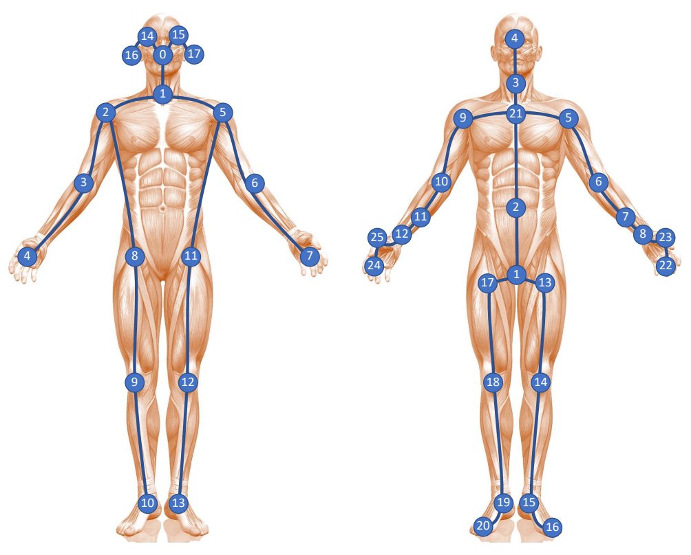

## COCO-keypoint

一共17个关键点

## Kinetics-skeleton

（openpose使用的标签）

OpenPose的姿态识别用了COCO数据库,coco有17个keypoint, **OpenPose增加了一个**, 用两侧肩膀生成一个中心点代表脖子，就是如下图openpose编号为1的人体中心点.

### ==数据结构==

对于一个 batch 的视频，我们可以用一个 5 维矩阵 ![[公式]](https://www.zhihu.com/equation?tex=%28N%2CC%2CT%2CV%2CM%29) 表示。

- ![[公式]](https://www.zhihu.com/equation?tex=N) 代表视频的数量，通常一个 batch 有 256 个视频（其实随便设置，最好是 2 的指数）。
- ![[公式]](https://www.zhihu.com/equation?tex=C) 代表关节的特征，通常一个关节包含 ![[公式]](https://www.zhihu.com/equation?tex=x%2Cy%2Cacc) 等 3 个特征（如果是三维骨骼就是 4 个）。
- ![[公式]](https://www.zhihu.com/equation?tex=T) 代表关键帧的数量，一般一个视频有 150 帧。
- ![[公式]](https://www.zhihu.com/equation?tex=V) 代表关节的数量，通常一个人标注 18 个关节。
- ![[公式]](https://www.zhihu.com/equation?tex=M) 代表一帧中的人数，一般选择平均置信度最高的 2 个人。
- 所以，OpenPose 的输出，也就是 ST-GCN 的输入，形状为 ![[公式]](https://www.zhihu.com/equation?tex=%28256%2C3%2C150%2C18%2C2%29) 。

链接：https://www.zhihu.com/question/276101856/answer/638672980。

## 标签对应关系

| openpose            | coco    | coco                   |
| ------------------- | ------- | ---------------------- |
| {0, "Nose"},        | 0       | {0, "nose"},           |
| {1, "Neck"},        | (5+6)/2 | {1, "left_eye"},       |
| {2, "RShoulder"},   | 6       | {2,"right_eye"},       |
| {3, "RElbow"}       | 8       | {3, "left_ear"},       |
| {4, "RWrist"},      | 10      | {4, "right_ear"},      |
| {5, "LShoulder"},   | 5       | {5, "left_shoulder"},  |
| {6, "LElbow"},      | 7       | {6, "right_shoulder"}, |
| {7, "LWrist"},      | 9       | {7, "left_elbow"},     |
| {8, "RHip"},        | 12      | {8, "right_elbow"},    |
| {9, "RKnee"},       | 14      | {9, "left_wrist"},     |
| {10, "RAnkle"},     | 16      | {10, "right_wrist"},   |
| {11, "LHip"},       | 11      | {11, "left_hip"},      |
| {12, "LKnee"},      | 13      | {12, "right_hip"},     |
| {13, "LAnkle"},     | 15      | {13, "left_knee"},     |
| {14, "REye"},       | 2       | {14, "right_knee"},    |
| {15, "LEye"},       | 1       | {15, "left_ankle"},    |
| {16, "REar"},       | 4       | {16, "right_ankle"},   |
| {17, "LEar"},       | 3       |                        |
| {18, "Background"}, |         |                        |

**openpose增加了一个neck（两个肩的中点）和background类**

## NTU-RGBD

标注示意图：（左侧为kinetics-skeleton，右侧为NTU-RGBD）

### 数据集划分

NTU数据集在划分**训练集和测试集**时采用了两种不同的划分标准。
**1、Cross-Subject**

Cross-Subject**按照人物ID**来划分训练集和测试集，训练集40320个样本，测试集16560个样本，其中将人物ID为 1, 2, 4, 5, 8, 9, 13, 14, 15,16, 17, 18, 19, 25, 27, 28, 31, 34, 35, 38的20人作为训练集，剩余的作为测试集。
**2、 Cross-View**

**按相机**来划分训练集和测试集，相机1采集的样本作为测试集，相机2和3作为训练集，样本数分别为18960和37920。
说到相机就不得不说相机的设置规则，三个相机，相机的垂直高度都是一样的，水平角度分别为-45°、0°和45°，每个动作执行人做两遍相同的动作，一个次对着左边的相机，一次对着右边的相机，也就是说最后会采集到2×3个不同角度的信息。最后，设置不同的相机高度及距离以增加视角多样性，并赋予一个设置号（1-17），见表2。
表2 设置号

在这里插入图片描述

### 文件命名方式

首先，数据集中有56880个.skeleton文件，每个文件代表一个样本，文件命名方式如下图所示。

- $S$后面跟的是设置号（1-17），正如表2所示
- $C$后面跟的是相机ID（1-3）
- $P$后面跟的是人物ID（1-40）
- $R$后面跟的是动作执行的遍数（1-2）
- $A$后面跟的是动作的分类（1-60）

### 数据的格式

可以用excel打开文件，里面的内容如下所示。

- 第1行为该样本的帧数
- 第2行为执行动作的人数
- 第3行共有10个数据分别代表'bodyID', 'clipedEdges', 'handLeftConfidence','handLeftState', 'handRightConfidence', 'handRightState','isResticted', 'leanX', 'leanY', 'trackingState'
- 第4行代表关节点数
- 第5-29行为25个关节点的信息，每个关节点有12个数据，分别代表'x', 'y', 'z', 'depthX', 'depthY', 'colorX', 'colorY','orientationW', 'orientationX', 'orientationY','orientationZ', 'trackingState'

以上为一帧的信息，其他帧都是上述表示方式。

# 参考链接

[NTU-RGB+D数据集](https://blog.csdn.net/weixin_51450749/article/details/111768242)