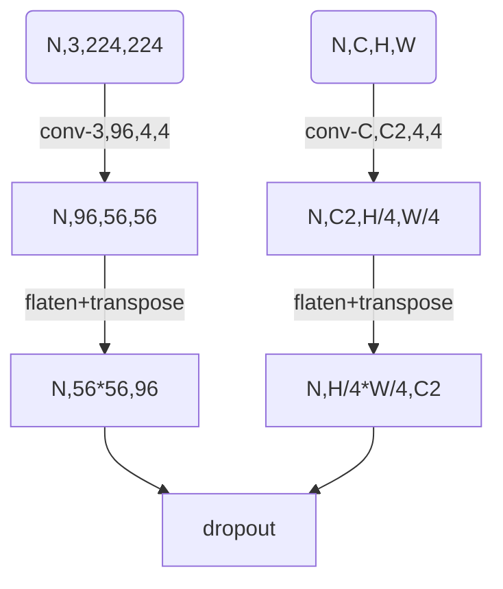
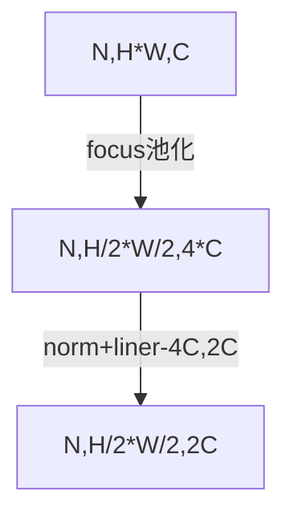
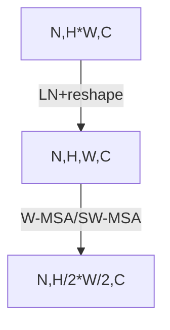

## Self-Attention

### 3.2 Q, K, V 的计算

Self-Attention 的输入用矩阵X进行表示，则可以使用线性变阵矩阵**WQ,WK,WV**计算得到**Q,K,V**。计算如下图所示，**注意 X, Q, K, V 的每一行都表示一个单词。**

### 3.3 Self-Attention 的输出

得到矩阵 Q, K, V之后就可以计算出 Self-Attention 的输出了，计算的公式如下：

公式中计算矩阵**Q**和**K**每一行向量的内积，为了防止内积过大，因此除以 ![[公式]](https://www.zhihu.com/equation?tex=d_%7Bk%7D) 的平方根。**Q**乘以**K**的转置后，得到的矩阵行列数都为 n，n 为句子单词数，这个矩阵可以表示单词之间的 attention 强度。下图为**Q**乘以 ![[公式]](https://www.zhihu.com/equation?tex=K%5E%7BT%7D) ，1234 表示的是句子中的单词。

得到![[公式]](https://www.zhihu.com/equation?tex=QK%5E%7BT%7D) 之后，使用 Softmax 计算每一个单词对于其他单词的 attention 系数，公式中的 Softmax 是对矩阵的每一行进行 Softmax，即每一行的和都变为 1.

得到 Softmax 矩阵之后可以和**V**相乘，得到最终的输出**Z**。

上图中 Softmax 矩阵的第 1 行表示单词 1 与其他所有单词的 attention 系数，最终单词 1 的输出 ![[公式]](https://www.zhihu.com/equation?tex=Z_%7B1%7D) 等于所有单词 i 的值 ![[公式]](https://www.zhihu.com/equation?tex=V_%7Bi%7D) 根据 attention 系数的比例加在一起得到，如下图所示：

# Swin-Transformer代码解析

## 预处理PatchEmbed

## stage

<u>**每个stage的输入和输出都是`N,HW,C`的形式，因此，最后的输出也相当于是一个特征图，与其他的backbone没有任何区别。**</u>

### PatchMerging

就是focus结构，替代池化使用的

以下的`N,H*W,C`等价于上一节的`N,H/4*W/4,C2`

### block

### W-MSA

**主要核心还是self-attention，只不过是局部使用而已，减少计算量。其实就是nonlocal**

### SW-MSA

## 参考链接

[Swin-Transformer结合代码深度解析](https://zhuanlan.zhihu.com/p/384514268)

[搞懂 Vision Transformer 原理和代码，看这篇技术综述就够了（十六）](https://mp.weixin.qq.com/s/EmplGLcnvjE6SN5WY5Cg2w)——介绍的非常详细（主要看这个，也有VIT的讲解）