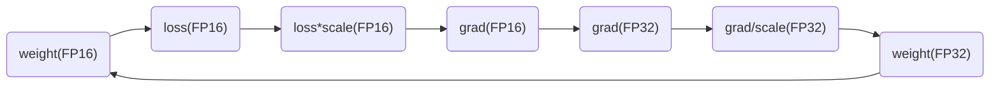

## 加速原理

TensorRT是**英伟达针对自家平台做的加速包**，TensorRT主要做了这么两件事情，来提升模型的运行速度。

1. TensorRT**支持INT8和FP16的计算**。深度学习网络在训练时，通常使用 32 位或 16 位数据。TensorRT则在网络的推理时选用不这么高的精度，达到加速推断的目的。
2. TensorRT**对于网络结构进行了重构**，**把一些能够合并的运算合并在了一起**，针对GPU的特性做了优化。现在大多数深度学习框架是没有针对GPU做过性能优化的，而英伟达，GPU的生产者和搬运工，自然就推出了针对自己GPU的加速工具TensorRT。一个深度学习模型，**在没有优化的情况下，比如一个卷积层、一个偏置层和一个relu层，这三层是需要调用三次cuDNN对应的API，但实际上这三层的实现完全是可以合并到一起的，TensorRT会对一些可以合并网络进行合并**。我们通过一个典型的inception block来看一看这样的合并运算。

在没有经过优化的时候，inception block是图1中的样子，一个既有深度，又有宽度，还有concat操作的结构。

首先，对于网络结构的**垂直整合**，即将目前主流神经网络的conv、BN、Relu三个层融合为了一个层，所谓CBR，合并后就成了图2中的结构。 

然后，TensorRT还可以对网络做**水平组合**，水平组合是指将输入为相同张量和执行相同操作的层融合一起，比如图3， 就将三个相连的1×1的CBR为一个大的1×1的CBR。

最后，**对于concat层，将contact层的输入直接送入下面的操作中，不用单独进行concat后在输入计算，相当于减少了一次传输吞吐。**

# FP16

参考链接：[入门mmdetection（捌）---聊一聊FP16](https://zhuanlan.zhihu.com/p/114438961)

## 原理

将模型放在FP16精度下运行，大幅减少内存占用量，可以提高batch和输入特征图大小。

推理在FP16下进行，权值更新在FP32下进行，确保低精度下仍然可以准确更新权值。

## 流程

==model负责计算FP16精度下的loss，放大后的梯度grad==

==optimizer负责计算FP32精度下的更新后的参数==

==将FP32的最终更新参数，拷贝到FP16的model中，完成最终的权值更新==

1. 拷贝模型(model)的权值参数到优化器(optimizer)；然后将model参数精度变为FP16。

   此时二者参数一致，只是model中的是FP16。本来optimizer中的权值是和model同一位置，通过该拷贝操作，实现model和optimizer中权值的解耦，方便后面使用optimizer在FP32精度上更新参数（原权值+梯度）使用。

2. 在model下计算loss（此时权值、特征图、loss都是FP16）；将loss乘以放大尺度（scale），然后进行反向传播求得梯度（此时梯度也是FP16）。

   如果不放大loss，那么梯度可能会非常的小，超出FP16的表达范围，放大后，所有求得的梯度也会随之放大，那么就可以用FP16表示了。

3. 拷贝梯度（FP16）到optimizer中（此时optimizer中的梯度变成了FP32）；将梯度（FP32）除以scale，还原原本的梯度；在optimizer中更新权值：原权值+梯度。

   梯度拷贝到优化器后，optimizer中的grad和权值都是FP32，那么就可以按照FP32的精度进行权值更新。

4. 拷贝optimizer中更新后的权值（FP32）到model中（FP16），完成FP16的推理，FP32下的权值更新。

