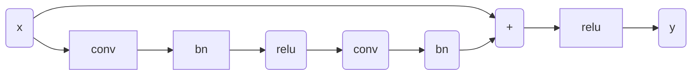

## 问题

简述CNN分类网络的演变脉络及各自的贡献与特点

## 综述

深度学习的浪潮就是从CNN开始的，它结构形态的变化也见证着这门技术的发展。现在涌进来学习深度学习的大部分人都是做计算机视觉的，因为这个门槛相对较低，业界数据集开源了很多，也比较直观，而且对硬件设备的要求也没语音那么大，导致现在就业竞争非常大。CV各种任务的网络结构变形更是日新月异，让人眼花缭乱，但是不管怎么变，基本都是基于卷积、池化和全连接这三件套。所以这篇文章主要是想回归一下最初CNN网络是怎么发展变化的。

## LeNet-5

LeNet 被视为CNN的开山之作，是LeCun大神在1998年提出的，**定义了基本组件：卷积、池化、全连接，俗称CPF三件套**。主要用于手写数字识别10分类问题，被广泛应用在金融领域。LeNet的结构非常简单，如名字所示的那样，主要有5层（这里没有统计紧跟每个卷积层后的 2x2 池化层，如果加上池化层，应该是7层），包括：**两层 5x5 卷积层和三层全连接层**。下面便是LeNet-5架构示意图。

### LeNet 的关键点与贡献：

1. LeNet 是**第一个将反向传播应用于实际应用的CNN架构**，突然之间，深度学习不再只是一种理论。
2. 定义了基本组件：卷积、池化、全连接。

## AlexNet

可以说深度学习浪潮是从这个网络开始的，它是 ImageNet 图片分类竞赛 2012 年的冠军。AlexNet 有着和 LeNet-5 相似网络结构，但更深、有更多参数。**AlexNet包含5层卷积和3层全连接，实现1000分类**。（注意：AlexNet 采用的 是11x11，7x7与5x5大小的卷积核）

有意思的是，在当时由于算力不足，作者将网络分上下两部分分别卷积，放在两块GPU上进行训练。这一操作倒是给了后来人的诸多启发，典型的如 shuffle-net，借用该想法进行轻量级改进。

### AlexNet 关键点与贡献：

1. 如上所述的**多 GPU 训练技术**。
2. 使用了 **ReLU** 激活函数，使之有更好的梯度特性、训练更快。 
3. 使用了**随机失活(dropout)**。
4. 大量使用**数据扩充**技术。

## VGG

这是 ImageNet 2014年的亚军网络。当然 ImageNet 2013也举办了竞赛，但是其中的 ZF-Net 也就只是调整AlexNet的参数，包括卷积核大小、卷积步长、通道数，没啥亮点可言。

VGG 主要在网络深度上进行探索，提出了两个深度的网络 **VGG16（13 层卷积 + 3 层全连接）**和 VGG19（16 层卷积 + 3 层全连接），由于VGG-16网络结构十分简单，并且很适合迁移学习，因此至今VGG-16仍在广泛使用。

### VGG 关键点与贡献：

1. **结构简单**，只有 3×3 卷积和2×2 汇合两种配置，并且**重复堆叠**相同的模块组合。卷积层不改变空间大小，每经过一次汇合层，空间大小减半。

   VGG提出了将所有这些卷积核分解为 3x3 卷积核的想法，按照感受野的概念去理解的话，两层 3x3 的卷积层的感受野与一层 5x5 的卷积层感受野一样，三层 3x3 的卷积层的感受野与一层 7x7 的卷积层感受野一样。但是 **3x3 卷积层的堆叠可以在获得相同感受野的前提下使用更少的参数，多层的卷积也能增加模型的非线性效果。**

2. **初始化方法：先训练浅层网络，并使用浅层网络对深层网络进行初始化。**（这是在 BN 层没提出来之前的很好的一种模型训练方法）。

## GoogLeNet

GoogLeNet 是 ImageNet 2014的冠军网络。GoogLeNet 不仅在深度上进行探索，还增加了网络的宽度，试图回答在设计网络时究竟应该选多大尺寸的卷积、或者应该选汇合层。其提出了Inception模块，同时用1×1、3×3、5×5卷积和3×3汇合，并保留所有结果。

### GoogLeNet 关键点与贡献：

1.  **多分支**分别处理，并级联结果。
2. 为了降低计算量，用了**1×1卷积**降维。
3. 使用了**全局平均汇合（Global average pooling）替代全连接层**，使网络参数大幅减少。

inception结构在之后的几年中从v1到v4不断改进。

> **Inception v2**  在 v1 的基础上加入 batch normalization 技术，在tensorflow中，使用==BN 在激活函数之前效果更好==；将 5x5 卷积替换成两个连续的 3x3 卷积，使网络更深，参数更少。
>
> **Inception v3** 核心思想是将卷积核分解成更小的卷积，如将 7x7 分解成 1x7 和 7x1 两个卷积核。
>
> **Inception  v4** 在Inception模块基础上结合了 residual 模块。

## ResNet

ResNet 是 ImageNet 2015年的冠军网络，是一个里程碑的事件。ResNet旨在解决网络加深后训练难度增大的现象。其提出了residual模块，包含两个3×3卷积和一个短路连接(左图)。==短路连接可以有效缓解反向传播时由于深度过深导致的梯度消失现象，这使得网络加深之后性能不会变差==。因此 ResNet 网络的层数有 152 之多。

### ResNet 关键点与贡献：

1. 使用**短路连接**，使训练深层网络更容易，并且**重复堆叠**相同的模块组合。
2. ResNet大量使用了**批量归一层**。
3. 对于很深的网络(超过50层)，ResNet使用了更高效的**瓶颈(bottleneck)**结构(右图)。

### 个人补充

**面临的问题：**随着网络的加深，模型出现了退化，并不是过拟合（高方差，低偏差）也不是梯度消失（因为使用了BN，而BN理论上可以解决梯度消失问题）。
加深网络的目的是希望，加深网络后，模型效果至少不会变差，即有一个恒等映射确保新添加的层什么都不做也能保持和原来一样的性能。但是由于ReLU的存在导致输入到输出的过程不可逆（信息丢失），因此反向传播过程很难从输出推导回完整的输入，这从直觉上可以理解为，网络越深模型学到的特征与先前层的特征差异越来越大，无法完整保留过去的特征（即恒等映射），因此需要赋予网络一种恒等映射的能力，保证随着网络的加深，网络不会发生退化。

**解决方法：**ResNet就引入短路连接（shortcut connect）机制，直接将恒等映射做为网络的一部分，将问题转换为学习一个残差函数。拟合残差要比拟合恒等映射要容易的多。

假设Residual Block的输入为 ![[公式]](https://www.zhihu.com/equation?tex=x) ，则输出 ![[公式]](https://www.zhihu.com/equation?tex=y+) 等于：

其中 ![[公式]](https://www.zhihu.com/equation?tex=%5Cmathcal%7BF%7D%5Cleft%28x%2C%5Cleft%5C%7BW_%7Bi%7D%5Cright%5C%7D%5Cright%29) 是我们学习的目标，即输出输入的残差 ![[公式]](https://www.zhihu.com/equation?tex=y-x) 。以上图为例，残差部分是中间有一个Relu激活的双层权重，即：

其中 ![[公式]](https://www.zhihu.com/equation?tex=%5Csigma+) 指代Relu，而 ![[公式]](https://www.zhihu.com/equation?tex=W_%7B1%7D%2CW_%7B2%7D) 指代两层权重。

*顺带一提，这里一个**Block中必须至少含有两个层**，否则就会出现很滑稽的情况：*

*显然这样加了和没加差不多……*

**该结构可以缓解梯度消失问题的原因：**

梯度反向传播公式如下
$$
\frac{\partial L}{\partial x}=\frac{\partial L}{\partial y}\frac{\partial y}{\partial x}=\frac{\partial L}{\partial y}(1+\frac{\partial F(x_1,{W_i})}{\partial x})
$$
可以看出，短路结构引入了1，使得梯度可以无损的传递到下一层，缓解了梯度消失问题。

**pytorch中实现的结构如下:**

#### 参考链接

[薰风读论文：Deep Residual Learning 手把手带你理解ResNet](https://zhuanlan.zhihu.com/p/77794592)

## ResNeXt

ResNeXt 是 ImageNet 2016年的亚军网络，是 ResNet 的一个改进。传统的方法通常是靠加深或加宽网络来提升性能，但计算开销也会随之增加。ResNeXt旨在不改变模型复杂度的情况下提升性能。受精简而高效的Inception模块启发，ResNeXt将ResNet中非短路那一分支变为多个分支。

### ResNeXt 关键点与贡献：

1. 在 ResNet 的短路连接基础上，综合了 Inception 的优点，使用多分支进行处理，但是与 Inception不同的是，其**每个分支的结构都相同**。
2. ResNeXt巧妙地利用**分组卷积**进行实现。

## DenseNet

**DenseNet**  其目的也是<u>避免梯度消失。</u>和residual模块不同，dense模块中任意两层之间均有短路连接。也就是说，每一层的输入通过级联(concatenation)包含了之前所有层的结果，即包含由低到高所有层次的特征。和之前方法不同的是，DenseNet中卷积层的滤波器数很少。DenseNet只用ResNet一半的参数即可达到ResNet的性能。
**语义融合**的代表，通过<u>跳跃连接所有的层来获得更好的聚合特征和误差</u>。

实现方面，作者在大会报告指出，直接将输出级联会占用很大GPU存储。后来，通过共享存储，可以在相同的GPU存储资源下训练更深的DenseNet。但由于有些中间结果需要重复计算，该实现会增加训练时间。 

## SENet

SENet 是 ImageNet 2017年的冠军网络，也是 ImageNet 竞赛的收官之作。SENet 通过额外的分支(gap-fc-fc-sigm)来得到**每个通道的[0, 1]权重**，自适应地校正原各通道激活值响应。以提升有用的通道响应并抑制对当前任务用处不大的通道响应。

这其实是一种**通道注意力机制**，因为不是每个通道的信息对结果都是同等重要的。

## MobileNet 和 ShuffleNet 轻量化网络

在实际中应用，CNN受限于硬件运算能力与存储（比如几乎不可能在ARM芯片上跑ResNet-152）。**所以必须有一种能在算法层面有效的压缩存储和计算量的方法。而MobileNet/ShuffleNet正为我们打开这扇窗。**

谈论起MoblieNet / ShuffleNet这些网络结构，就绕不开**分组卷积 Group convolution**，甚至可以认为这些网络结构只是Group convolution的变形而已。（不了解分组卷积的请移步到问题 " 48_各种卷积方式串讲.md "）。<u>分组卷积可以大大减少参数量和计算量</u>。

其实我们上面在讲 AlexNet 的时候说到多 GPU 训练，其实便用到了分组卷积这个操作，将整个网络分成了两组。

### MobileNet v1

Mobilenet  v1是Google于2017年发布的网络架构，旨在充分利用移动设备和嵌入式应用的有限的资源，有效地最大化模型的准确性，以满足有限资源下的各种应用案例。Mobilenet v1也可以像其他流行模型（如VGG，ResNet）一样用于分类、检测、嵌入和分割等任务提取图像卷积特征。

Mobilenet v1核心是把卷积拆分为 Depthwise + Pointwise 两部分。

**Depthwise** 是对 $N*C*H*W$ 的输入进行 group = C 的分组卷积，每一组做 kernel = 3x3，pad = 1，stride = 1 的卷积，因此输出仍然为  $N*C*H*W$ 。这样相当于==收集了每个Channel的空间特征==，即Depthwise特征。

**Pointwise** 是对 $N*C*H*W$ 的输入进行 k 个普通的 1x1 卷积，收集每个点的特征，最终输出为 $N*k*H*W$ 。

> **Depthwise只提取通道内部的特征，但是通道与通道间信息是相互隔离的；而Pointwise通过提取每个点的特征，对每个通道间的信息进行交换。Depthwise+Pointwise相当于把普通卷积分为了2个步骤而已。**

下面作图为普通的卷积，右图为MobileNet 中的卷积。

MobileNet v2 简化来说就是在 v1 基础上引入了 residual 结构，所以就不展开了。

### ShuffleNet v1

ShuffleNet是Face++提出的一种轻量化网络结构，主要思路是使用Group convolution和Channel shuffle改进ResNet，可以看作是ResNet的压缩版本。

这里再回顾一下ResNet的bottleneck网络结构，如图13。注意Channel维度变化：256D-64D-256D ，宛如一个中间细两端粗的瓶颈，所以称为“bottleneck”。这种结构相比VGG，早已经被证明是非常效的，能够更好的提取图像特征。

下图展示了ShuffleNet的结构，其中(a)就是加入Depthwise的ResNet bottleneck结构，而(b)和(c)是加入Group convolution和Channel Shuffle的ShuffleNet的结构。

如同上面的 MobileNet ，ShuffleNet 也可以减少参数量和计算量。但为什么要引入Channel Shuffle操作呢？

> ShuffleNet的本质是将卷积运算限制在每个Group内，这样模型的计算量取得了显著的下降。然而导致模型的信息流限制在各个Group内，组与组之间没有信息交换，这会影响模型的表示能力。因此，需要引入组间信息交换的机制，即Channel Shuffle操作。同时Channel Shuffle是可导的，可以实现end-to-end一次性训练网络。

下面详细讲解下 channel shuffle 具体是怎么实现的：

假设输入的 feature map 有 9 个 channels，groups = 3，分成三组：

第一步进行 ==reshape==：

第二步对得到的矩阵进行==矩阵转置==操作：

最后再一次进行==reshape==操作：

---

向照夷补充

## HRNet

**高分辨率始终存在**，而不是从低分辨率中恢复，信息表达能力更强，可以提高对小目标的检测性能

## DLA

下图用于语义分割网络，从而融合了不同分辨率的特征。

提出了IDA（下面的黄线）用于融合不同stage的特征。（借鉴了FPN）
HDA（方框内的结构），增强每个stage内部多个block的特征融合。（借鉴了DenseNet）

## NonLocal

主要是为了建立远距离像素点之间的关系。参考了transformer的思想，即远距离建模。
结合下面两个示意图理解即可，和self-attention一模一样。

## ResNeSt

### 参考链接

[ResNet最强改进版来了！ResNeSt：Split-Attention Networks](https://zhuanlan.zhihu.com/p/132655457)

## 参考资料

[(二)计算机视觉四大基本任务(分类、定位、检测、分割)](https://zhuanlan.zhihu.com/p/31727402)
[轻量化网络ShuffleNet MobileNet v1/v2 解析](https://zhuanlan.zhihu.com/p/35405071)
[Tensorflow笔记——channel shuffle的实现](https://blog.csdn.net/baidu_23388287/article/details/94456951)

